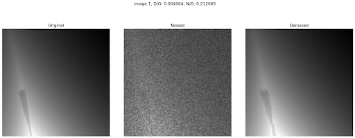

# DepthDiff: Agnostic Noise Removal in Depth Images Using Diffusion

## Table of contents

* [Motivation](#motivation)

* [Dataset](#dataset)

* [Architecture and Conditional Embedding](#architecture-and-conditional-embedding)

* [Scheduler](#scheduler)

* [Why this will work??](#why-this-will-work)

* [Results](#results)

    * [Metrics](#metrics)

    * [In-Distribution Results](#in-distribution-results)

    * [Out of Distribution Results](#out-of-distribution-results)

* [Problems and future](#problems-we-are-facing)

## Motivation

Depth images given out by depth sensor or obtained through stereo pair aare reliable only till a particular distance(~ 6m in general). And sometimes even within this range values of depth obtained are not reliable, especially in case of depth sensors after finetuning parameters. This was the case with one of our labs Realsense D434. The main objective is to remove the noise from the depth images obtained from depth sensor and hopefully tackle the problems from stereo pair as well.

Diffusion have changed the way we think about generation capabilites of AI and it is not only limited to modalites of image but also video, sounds and text. And applications of concept of diffusion models itself is not limited to generative AI. Essentially, diffusion is of two steps. Forward process where noise is added to data and reverse process where noise is removed from data. This reverse process is strikingly similar to the task we want to accomplish in our main objective. So I came up with an idea where I can remove the noise agnostically.

## Dataset

It is generated using AI2THOR.

## Architecture and Conditional Embedding

We took DiT-S and for conditioning we are using Dino V2 emebeddings.
Theoritically, any representation that emboids structural information can be used for Conditioning

## Scheduler

The scheduler is called Alpha scheduler.

$$
x_t = (1-\alpha_t)x_0 + \alpha_t x_T
$$

where $0 <= \alpha_t <= 1$ and $0 <= t<= T$ and $x_T$ is noised depth image, $x_0$ is noise free depth image

### Reasoning

General schedulers for diffusion models are DDPM based or DDIM based. These schedulers can't be used in our case for two reasons. 

Look at the equation that adds noise to noise-free depth image.

$$
x_{noised} = x_{noise-free} + \epsilon
$$

The first intuitive idea would be to noise the noised depth image i.e $x_{noised}$ with gaussian noise in forward process and train model to denoise it to get back noise free depth image i.e $x_{noise-free}$ in reverse process.

* This can be possible if we want to deal with only one type of noise. But if we want to remove noise agnoistically this is not possible.

* Generally, we train diffusion models with max number of timesteps to 1000. This can be improved.

Max time steps issue can be solved if $x_{noised}$ is part of scheduler's output. But if considering forward process equation of DDPM,
$$
x_{t} = \sqrt{1-\beta_t} x_{t-1} + \sqrt{\beta_t} \epsilon  
\\or\\
x_{t} = \sqrt{\bar{\alpha_t}} x_0 + \sqrt{1-\bar{\alpha_t}} \epsilon
$$

it is not guranteed that we can always find $x_{noised}$ i.e, $\hat{x_t} = \hat{x_0} + \epsilon$ in output of forward process i.e, $\hat{x_t}$ in $x_t$. This is one reason.

And other is DDPM and DDIM schdulers are based on gaussian noise. And their forward and reverse processes are defined using gaussian noise $\epsilon$ and initial image $x_0$ making them heavily reliant on $\epsilon$.

As we want $x_{noised}$ as output of scheduler, instead of basing scheduler on $x_0$ and $\epsilon$, we base it on $x_T$ and $x_0$ i.e, noised and noiseless. Hence, the equation will be,

$$
x_t = (1-\alpha_t)x_0 + \alpha_t x_T
$$

where $0 <= \alpha_t <= 1$ and $0 <= t<= T$ and $x_T$ is noised depth image, $x_0$ is noise free depth image.

This is inspired from alpha-blending in Computer Vision.

## Why this will work??

Imagine a depth image that is noiseless and up-to scale. Let it be O. Get A by bringing range of O between 0 to 1. And B, by adding noise to O. 

Now, given A and B can we get back O? Depending on the noise we used to get B, yes we can. Now lets add some conditions to the noise.

1) The noise model we are using to noise 0, monotonically increases with distance/depth.

2) Noise from noise model is zero or negligible within x meters. (assume 1 meter).

The above two conditions reflect noise in real world conditions. Now given A and B with noise model following above two conditions, we can recover O with good accuracy by solving the optimization problem.

Here, Diffusion model acts as smart optimizer, A acts as structural information and B is input noised image.

## Results

We have used 8 different noise models during training so that diffusion model won't learn the pattern but behave as expected.

* 2 linear noise models

* 2 quadratic noise models

* 2 cubic noise models

* 2 constant noise models (specifically, zero noise)

### Metrics

The metric we are using to compare is L2 loss wrt Noiseless image. Hence,

`N/O`: L2 Loss between Noised Image and Noiseless/Original Image

`D/O`: L2 Loss between Denoised Image and Noiseless/Original Image

### In-Distribution Results

### Out-of-Distribution Results

## Problems we are facing

Because our dataset is of synthetic in nature, we are unable to extend it to real-world applications.  

**Code will be updated soon**

